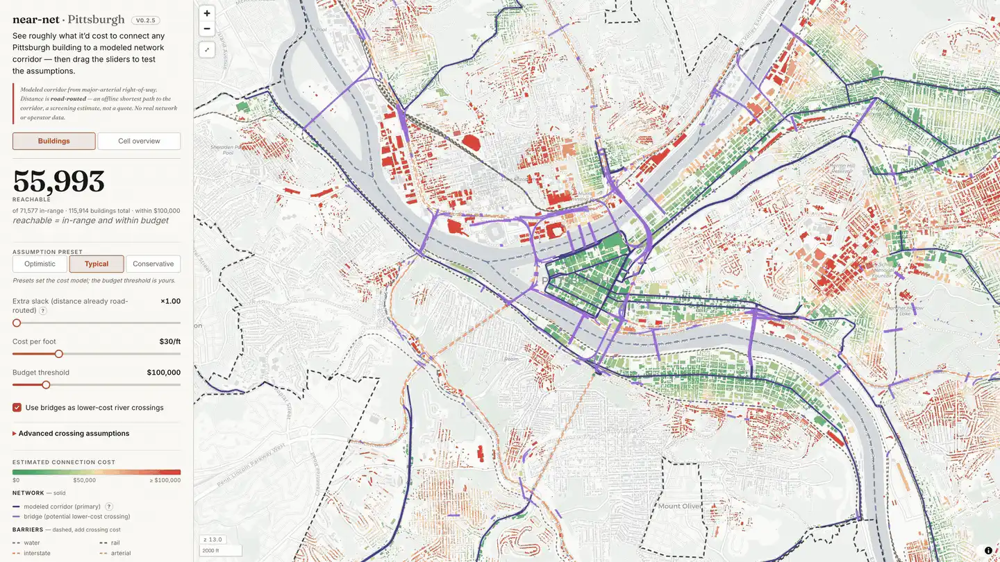
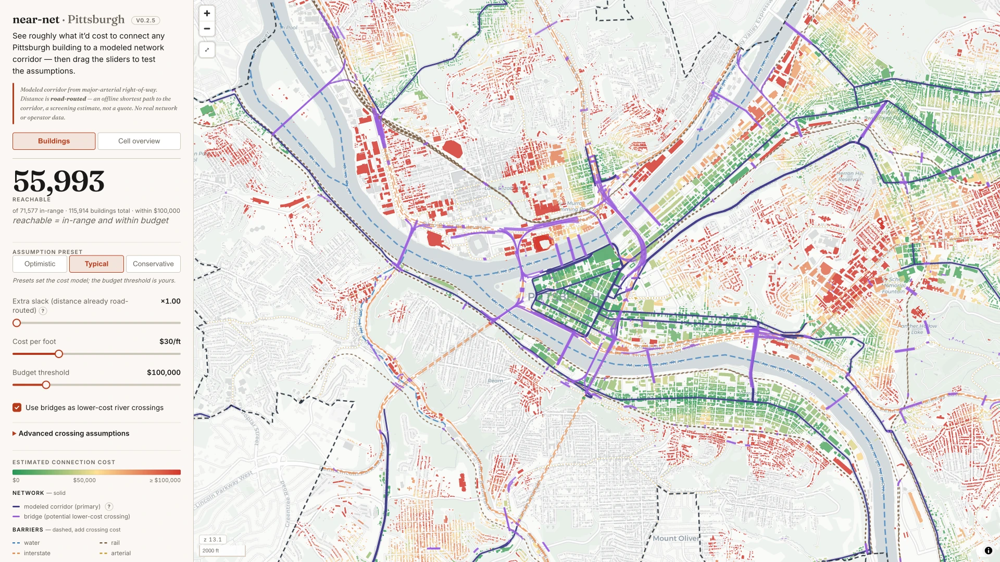
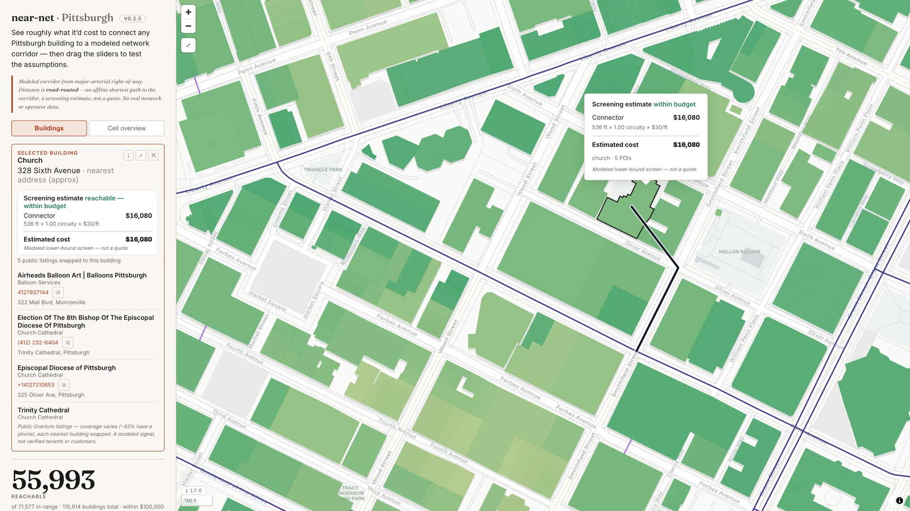
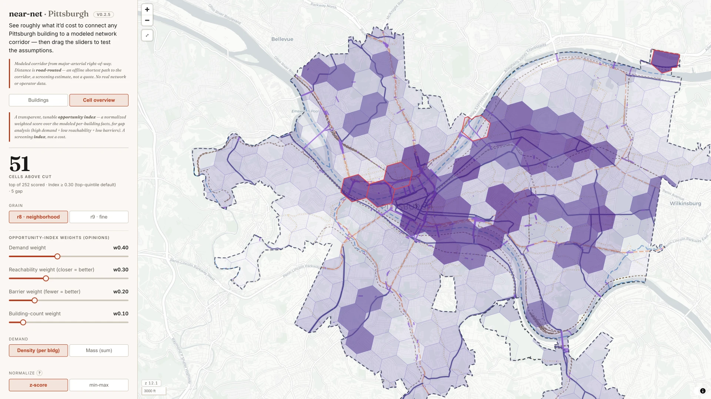
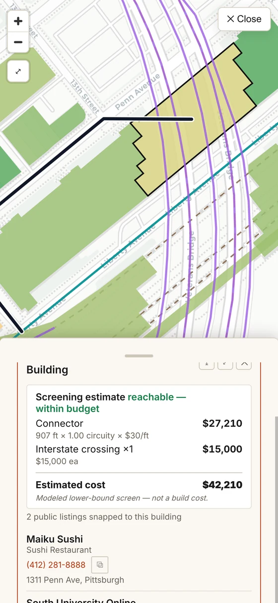

# nearnet-pittsburgh

**▶ Live demo: https://the-snowmen.github.io/nearnet-pittsburgh/**



An end-to-end, no-backend spatial-data pipeline for Pittsburgh: it precomputes road-routed
proximity facts for 115,914 buildings, publishes them as static GeoParquet/PMTiles, and lets a
browser screen modeled connection scenarios without routing in the browser.

It uses public base geometry plus synthetic/proxy network attributes. The map measures distance
to a **modeled corridor**, not a verified network; every result is a screening estimate, not a quote.

## What I built

- **Offline spatial pipeline:** public-data ingest, EPSG:2272 measurement, multi-source Dijkstra,
  crossing analysis, and static GeoParquet/PMTiles export.
- **Browser analytics:** DuckDB-WASM recalculates the full-city screen from slider assumptions;
  MapLibre updates a 115k-building cost surface without a backend.
- **Explorable product surface:** building dossiers, routed connectors, opportunity cells,
  per-building KMZ export, and a mobile bottom sheet.

- **Design (source of truth):** [docs/DESIGN.md](docs/DESIGN.md)
- **Project history:** [docs/HISTORY.md](docs/HISTORY.md)
- **POI opportunity-signal policy:** [docs/POI_CATEGORIES.md](docs/POI_CATEGORIES.md)

**What's live:** the road-routed proximity **screen** (cost-colored building surface + reachable-within-budget
sliders), a second **cell-overview** altitude (H3 opportunity-index choropleth that drills back into the
building screen), a click-to-select building **dossier** (nearest modeled corridor + per-POI detail + nearest
address) with **per-building KMZ export**, and a mobile bottom-sheet layout — all over a **modeled** corridor,
not a verified network or operator dataset.

## What it looks like

<table>
  <tr>
    <td width="50%" valign="top">
      
      <br><sub><b>Cost surface.</b> Every building shaded by its modeled screening estimate (green = lower, red = higher); the ramp tops out at your budget.</sub>
    </td>
    <td width="50%" valign="top">
      
      <br><sub><b>Building dossier.</b> Click any building for an itemized screening estimate — routed connector distance, barrier crossings, and nearby public listings.</sub>
    </td>
  </tr>
  <tr>
    <td width="50%" valign="top">
      
      <br><sub><b>Cell overview.</b> A second altitude: an H3 opportunity-index choropleth — a unitless modeled signal (not dollars) for gap-spotting.</sub>
    </td>
    <td width="50%" align="center" valign="top">
      
      <br><sub><b>Mobile.</b> Responsive bottom-sheet layout — tap a building to slide up its screening estimate.</sub>
    </td>
  </tr>
</table>

## Architecture in one line

Geographic **facts** (distances, crossings) are baked once, offline, into static GeoParquet;
cost **opinions** (cost-per-foot, circuity, budget) live on browser sliders. The browser does
arithmetic over baked facts — **no routing in the browser, ever** (DESIGN.md §2).

## `build/` — the offline ETL (Phase 0)

Runs **once on a build machine** to produce the static `data/*.parquet`. The shipped web app
ships **none** of this Python. The build routes/joins offline and bakes facts; see
[docs/DESIGN.md §2](docs/DESIGN.md).

```
build/
  config.py      # locked constants + Phase-0 tunable starting guesses (single source of truth)
  sources.py     # Overture (DuckDB+httpfs) / OSM (OSMnx features + routable graph) / TIGER (pygris), clipped to the City polygon
  routing.py     # V2: real road-following connector — multi-source Dijkstra over the OSM street graph to the corridor
  geometry.py    # EPSG:2272 routed connectors, ST_Crosses-gated crossing counts, bridge proximity, POI assignment
  cells.py       # V1.5: pure GROUP BY of buildings.parquet -> H3 opportunity-index cell layers
  measure.py     # Phase-0 tunables report -> data/phase0_report.{json,md}
  emit.py        # GeoParquet (geometry back to EPSG:4326) + §9 closing-query validation
  export_web.py  # split GeoParquet -> browser assets (facts parquet, connectors, GeoJSON, PMTiles)
  precompute.py  # CLI orchestrator
```

### Setup (conda — ETL only)

The GIS stack (geopandas/shapely/osmnx/pygris) is for the **build step only**. The app needs
no Python.

```bash
conda create -n nearnet python=3.12 -y
conda activate nearnet
pip install -r requirements.txt
```

### Run

```bash
# Fast end-to-end smoke test — confluence region (Golden Triangle + North Shore + South Side)
python -m build.precompute --sample 500

# Full City of Pittsburgh run (all buildings; multi-GB Overture scan)
python -m build.precompute --full

# Reuse the cached source layers from a prior run (fully offline)
python -m build.precompute --sample 500 --skip-fetch

# Geometry + measurement only, skip GeoParquet emission
python -m build.precompute --measure-only
```

Outputs land in `data/` (gitignored, fully reproducible): `buildings.parquet` (one row per
candidate, all DESIGN.md §9 columns) + companion layers (`network`, `barriers_*`, `bridges`)
+ `phase0_report.{json,md}` (the distance/POI/crossing distributions that lock the deferred
tunables `D_max`, POI snap distance, and corridor density).

## Stack

- **App:** MapLibre GL JS + React/TypeScript, DuckDB-WASM over static GeoParquet, PMTiles building tiles (raster CDN basemap), GitHub Pages.
- **Build:** Python — Overture/OSM/TIGER ingest, EPSG:2272 geometry, DuckDB emit.

## Licensing

Code: **MIT**. Data carries its own terms (OSM **ODbL** attribution + share-alike; Overture,
USGS NHD, Census TIGER attribution) — see [docs/DESIGN.md §12](docs/DESIGN.md).

## GitHub presentation

Use [cost.webp](docs/images/cost.webp) as the repository social-preview image in GitHub’s
**Settings → General → Social preview**. The project does not synthesize a separate marketing
image: links should show the real application.
